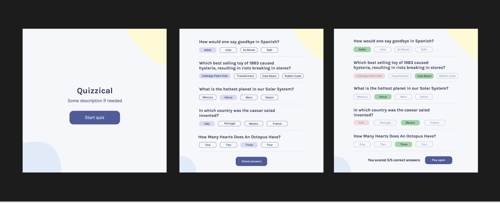

# Quizzical

A Quiz app - the 4th Solo Project from Scrimba's free Intro to React Course

The app uses the Open [Trivia Database](https://opentdb.com/).

Tweaked the Scrimba design slightly with a gradient background rather than those "blobs" - not a fan.

### Original Design from Scrimba

### Features

- highlight on users selected answers
- visible indication whether answer is right or wrong (green vs red)
- total score at end of game

### Extra Features

- Dropdowns for user to select the category, difficulty & number of questions

Live preview: ()
